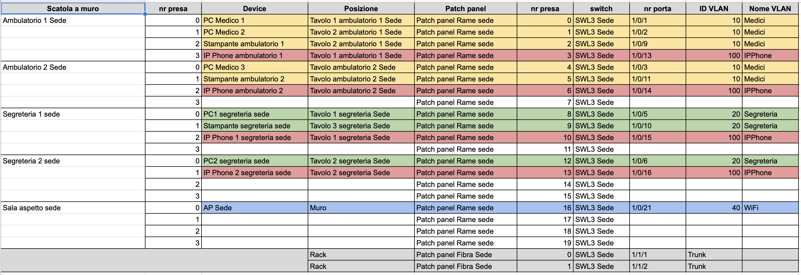

# Progetto di rete per studio dentistico

## Descrizione
Lo studio dentistico presenta due sedi in due palazzine diverse, collegate in fibra.  
L'esercitazione prevede l'uso esclusivo del diagramma fisico per:
- la realizzazione di un esempio di cablaggio strutturato,
- il posizionamento e la configurazione degli apparati e degli endpoint
- la realizzazione dei collegamenti.

I collegamenti vanno documentati con una tabella come quella proposta e condivisa sul corso Classroom.
Link al corso: https://classroom.google.com/c/MTY0NDYwNTM0NDUw

 
