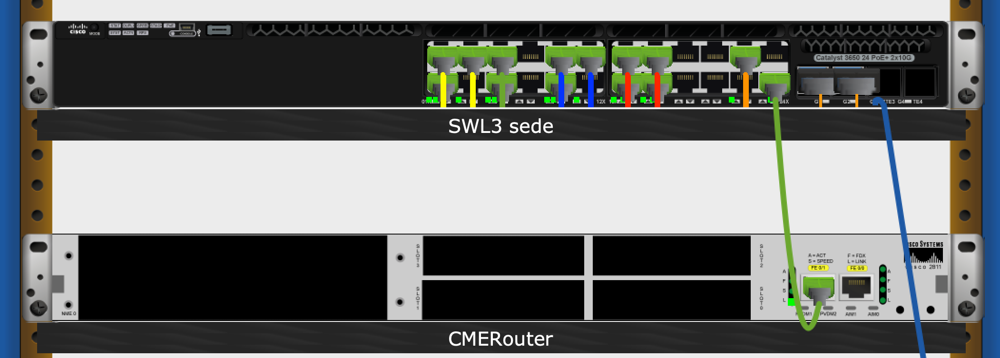

# Progetto di rete per studio dentistico

## Descrizione
Lo studio dentistico presenta due sedi in due palazzine diverse, collegate in fibra.  
L'esercitazione prevede l'uso esclusivo del diagramma fisico per:
- la realizzazione di un esempio di cablaggio strutturato,
- il posizionamento e la configurazione degli apparati e degli endpoint
- la realizzazione dei collegamenti.

I collegamenti vanno documentati con una tabella come quella proposta e condivisa sul corso [Classroom](https://classroom.google.com/c/MTY0NDYwNTM0NDUw).

 

## Istruzioni

### Sede
Per la realizzazione del progetto è necessario eseguire le seguenti operazioni:
#### Ambienti
1. Aggiungere un *New Closet* all'ambulatorio 1, assegnare come nome **Tavolo 1 ambulatorio Sede 1** e successivamente aggiungere un tavolo
   > Attenzione: modificare le misure del closet impostando una larghezza di 1 metro, una lunghezza di 2 ed un'altezza di 1. 
   > L'operazione dovrà essere ripetuta per ogni nuovo Closet aggiunto al diagramma in modo da rispettare le dimensioni reali degli elementi. 
2. Aggiungere tutti i dispositivi elencati nella tabella della scheda Sede (Tabella collegamenti su Classroom)
3. Effettuare i collegamenti fra i device e le prese a muro
4. Posizionare 1 access point AP-PT-N in sala di aspetto e collegare l'apparato alla presa a muro

#### Armadio
1. Aggiungere uno switch L3 mod. 3660 24PS
2. Aggiungere due modulo fibra
3. Aggiungere due alimentatori
4. Collegare le porte del patch panel in rame alle porte dello switch secondo le indicazioni riportate in tabella
   > Per una gestione successiva più semplice, è preferibile usare patch-cord dello stesso colore delle VLAN riporate in tabella
### Palazzina
#### Ambienti
1. Posizionare 2 closet (Tavolo 1 ambulatorio 1 Palazzina e Tavolo 2 ambulatorio 1 Palazzina) in Ambulatorio 1 con 1 tavolo ciascuno
2. Posizionare 1 closet (Tavolo ambulatorio 2 Palazzina) con 2 tavoli
3. Posizionare 2 closet (Tavolo 1 Segreteria Palazzina e Tavolo 1 Segreteria Palazzina) in Segreteria con 1 tavolo ciascuno
   > Ricordarsi di modificare le dimensioni dei closet!
4. Posizionare sui tavoli i Device necessari a garantire:
   - Ambulatorio 1:
     - 1 postazione medico,
     - 1 telefono VoIP
     - 1 stampante
   - Ambulatorio 2:
     - 1 postazione medico
     - 1 stampante
     - 1 telefono VoIP
   - Segreteria:
     - 1 postazione
     - 1 stampante
     - 1 telefono VoIP
   - Sala di aspetto:
     - 1 access point AP-PT-N
5. Effettuare i collegamenti a muro degli apparati documentando le connessioni in un nuovo foglio del file Google sheet dedicato ai collegamenti presenti in Palazzina
#### Armadio
1. Aggiungere uno switch modello PT_Empty ed inserire negli alloggiamenti due prese fibra e due prese rame a Gigabit, e rinominare in modo adeguato l'apparato
2. Aggiungere uno switch modello 2960  e rinominare in modo adeguato l'apparato
3. usare due bretelline in fibra per collegare le porte di PT-Empty al patch panel in fibra
4. Usare due patch-cord per collegare PT_EMPTY e 2960 (si configureranno successivamente le porte in etherchannel)
5. Effettuare tutti i collegamenti fra patch panel in rame e switch 2960 documentando le connessioni in un nuovo foglio del file Google sheet dedicato ai collegamenti presenti in Palazzina
   > Per una gestione successiva più semplice, è preferibile usare patch-cord dello stesso colore delle VLAN riporate in tabella

## Fase 2 - configurazione apparati

### Configurazione di base

Utilizzando un laptop (NBAdmin), connettersi qgli switch della rete con cavo console e, attraverso Terminal, effettuare le seguenti configurazioni (utilizzare i nomi riportati nella tabella di progetto):

- hostname  
  > hostname ... 
- message of the day
  > banner motd #Accesso consentito solo al personale autorizzato.#
- impostare *cisco* come secret per il privileged mode 
  > enable secret cisco
- attivare il servizio di crittografia delle password
  > service password-encryption
- bloccare il login per 120 secondi dopo 3 tentativi falliti in 60 secondi
  > login block-for 120 attempts 3 within 60
- configurare la sicurezza per la linea console 0:
  > line con 0  
  > password cisco  
  > login. 
- configurare le linee vty da 0 a 4:
  > line vty 0 4  
  > login local  
  > transport input ssh  
- disattivare le linee vty da 5 a 15
  > line vty 5 15  
  > no login  
  > transport input none  
- impostare un nome di dominio
  > ip domain-name studiodentistico.it
- creare una chiave rsa da utilizzare per le connessioni ssh:
  > crypto key generate rsa ...
- creare un account utente da utilizzare per le connessioni ssh:
  > username admin privilege 15 secret cisco
- disattivare tutte le porte degli switch non utilizzate
  > interfacce fa...  
  > shutdown

### Etherchannel
Creare i channel-group secondo le indicazioni riportate nella tabella di progetto
> Attenzione: per definire un channel group con interfacce che fanno parte di banchi diversi, utilizzare il comando  
> interface range interfaccia 1, interfaccia 2 (sostituire con i nomi reali delle interfacce)  
> channel-group 1 mode on  

### Trunk
Attivare la modalità trunk per i collegamentoi fra switch, seonco le indicazioni riportate nella tabella di progetto.
> Attenzione: configurare la modalità trunk sulle interfacce create con etherchannel:  
> interface Po1  
> interface Po2  
> ...  
#### SWL3Sede
> switchport trunk encapsulation dot1q  
> switchport mode trunk. 

#### SWBackbone e SWPalazzina
> switchport mode trunk  

### VTP
> vtp version 2  
> vtp domain studiodentistico  
> vtp password cisco  
  >> SWBackbone e SWPalazzina:  
  >>> vtp mode client

### VLAN
Su SWL3Sede creare le VLAN riportate nella tabella di progetto
> vlan 10  
> name Medici  
> vlan 20  
> name ...  
> ...  

Assegnare le porte degli switch alle vlan secondo quanto riportato nelle tabelle di progetto.
> interface fa0/1  
> switchport mode access  
> switchport access vlan ...  

### Indirizzi IP VLAN
Su SWL3Sede assegnare gli indirizzi IP previsti per il DefaultGateway alle rispettive VLAN seco le indicazioni riportate nella tabella di progetto.
> int vlan 10
> ip address 192.168.10.254 255.255.255.0
> ...

### Indirizzi IP apparati
Assegnare a SWBackbone e SWPalazzina gli indirizzi IP riportati nella tabella di progetto.
> interface vlan 200  
> ip address ... 

### DHCP
Su SWL3Sede definire i seguenti pool in dhcp per la configurazione dinamica dei dispositivi endpoint.
> ip dhcp pool Medici  
> network 192.168.10.0 255.255.255.0  
> default-gateway 192.168.10.254  
  
> ip dhcp pool Segreteria  
> network 192.168.20.0 255.255.255.0  
> default-gateway 192.168.20.254  
  
> ip dhcp pool Stampanti  
> network 192.168.30.0 255.255.255.0  
> default-gateway 192.168.30.254  
  
> ip dhcp pool WiFi  
> network 192.168.40.0 255.255.255.0  
> default-gateway 192.168.40.254  

### Indirizzi IP endpoint
Utilizzando DHCP assegnare la configurazione ai dispositivi endpoint (ad eccezione dei telefoni VoIP).

## Fase 3 - Configurazione VoIP
Per attivare i servizi VoIP all'interno dello studio dentistico è necessario aggiungere alla rete un dispositivo che sia in grado di fornire servizi di telefonia. Cisco fornisce una licenza per i propri router che, attivata, rende disponibili tali funzionalità.  
In Packet Tracer è presente un router che presenta tale licenza attivata ed è il Cisco 2018 IoS15.
Come primo step andiamo quindi ad installare il router 2011 IoS15 nell'armadio di rete della Sede, ed assegnamo come nome **CMERouter** (Call Manager Express Router). 
   
Come si vede dalla figura, e riportato nel foglio Google dei collegamenti, è necessario connettere la porta Fa0/0 del router con la porta Gi1/0/24 dello switch L3.  

### Configurazione di base
Utilizzando una connessione **Terminal** sulla porta **console**, procedere alla configurazione di base del router, come precedentemente fatto per gli switch presenti nella rete.

### Configurazione IP
I servizi di telefonia prevedono l'uso di una VLAN dedicata alla quale aggiungere tutti gli apparecchi VoIP. Per far sì che le comunicazioni fra telefoni e router funzionino correttamente, è necessario che la VLAN sia trasportata fino al router attraverso un collegamento trunk con lo switch layer 3 della sede. E' inoltre necessario che il router acceda anche alla VLAN 200, predisposta per la gestione degli apparati.

> interface FastEthernet0/0.100
  > encapsulation dot1Q 100
  > ip address 192.168.100.254 255.255.255.0

> interface FastEthernet0/0.200
  > encapsulation dot1Q 200
  > ip address 192.168.200.253 255.255.255.0
   
